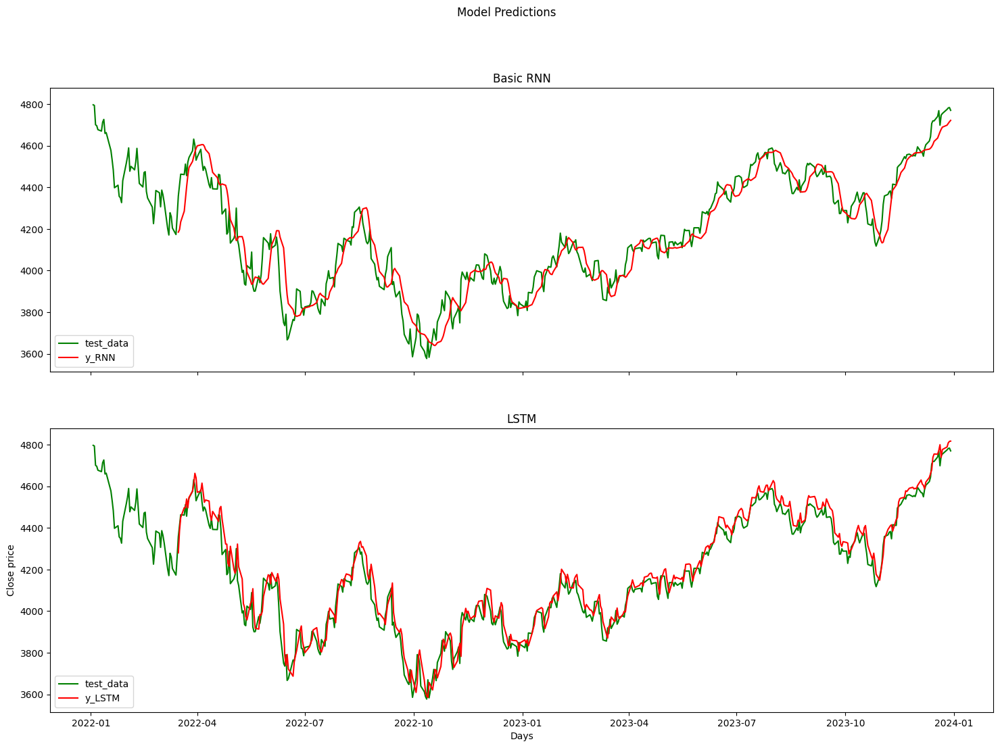

# Portfolio

---

# Deep Learning: Time Series Forecasting.

## Forecasting S&P 500 Stock Index.

    <em>Key Skills: Python, time series analysis, machine learning, statistical modeling (ARIMA, SARIMA), deep learning (LSTM).</em>

 

This project explores the potential of deep learning for stock market forecasting by developing a Long Short-Term Memory (LSTM) neural network model to predict the future prices of the S&P 500 index. The LSTM model will be compared with traditional statistical models, ARIMA and SARIMA, to evaluate its effectiveness in capturing complex patterns and making accurate predictions. The project aims to develop a robust and reliable LSTM model that can provide valuable insights for investors and financial analysts in making informed decisions.

 

 

---

# Supervised Machine Learning: Classification.

## Osteoporosis Risk Prediction.

    <em>Key Skills: Python, Exploratory data analysis, machine learning algorithms (Logistic Regression, Decision Tree, Random Forest, KNN, SVC, Gradient Boosting), model evaluation and selection.</em>

 

The project focuses on the implementation of <b>machine learning models to predict the risk of osteoporosis</b> in patients from their medical records. They identified significant factors that influence risk, such as age, hormonal changes, medical history, lifestyle and nutrition. <b>Gradient Boosting</b> proved to be the <b>most effective model</b>, with an <b>accuracy of 92.01%</b>. This model has promising potential for early intervention and preventive strategies.

 

 

---

© 2024 Juan Pablo Ortega. Powered by Jekyll and the Minimal Theme.

