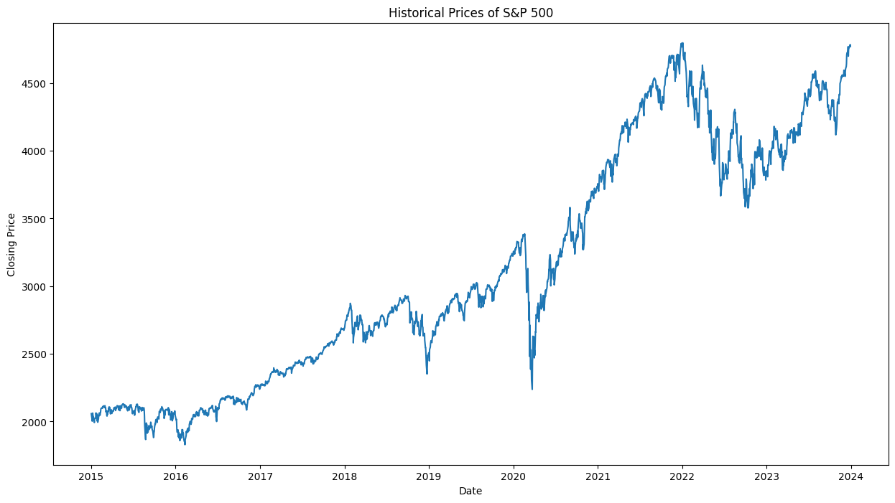
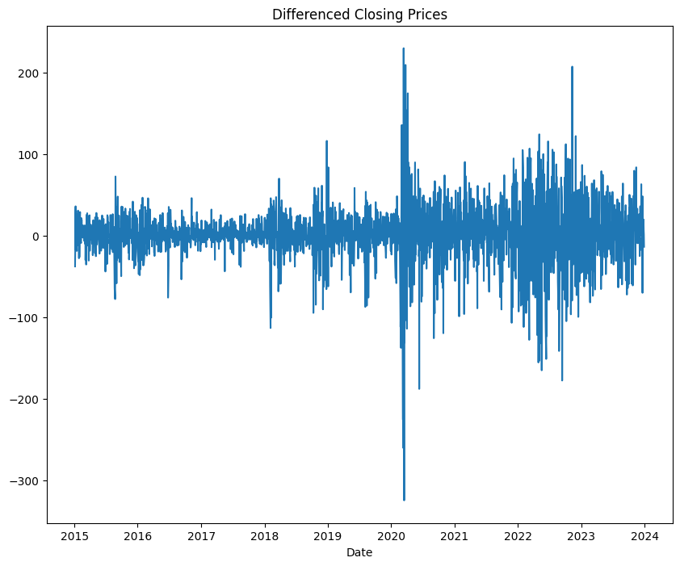
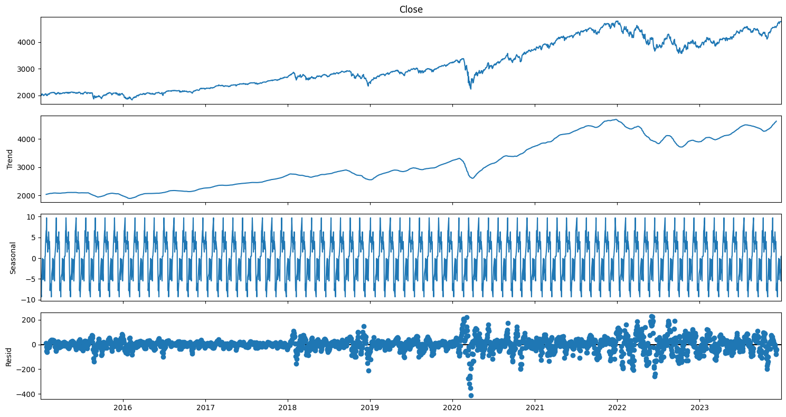
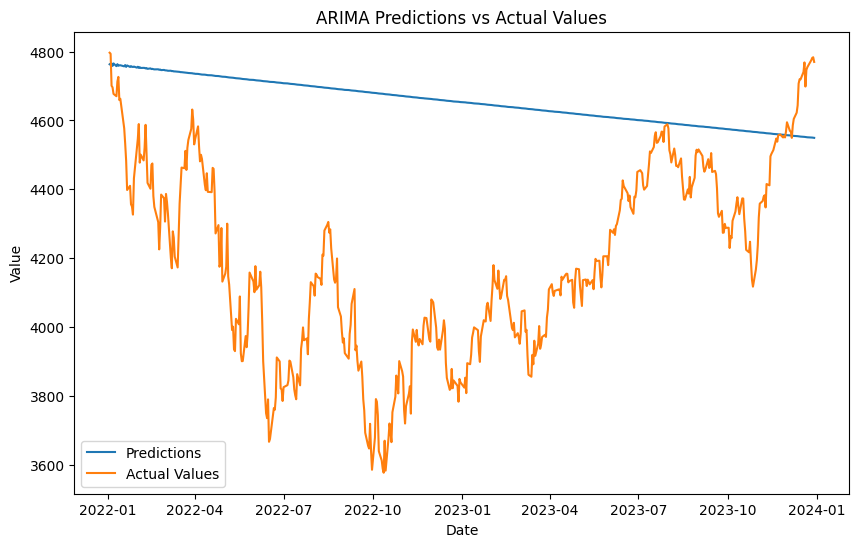
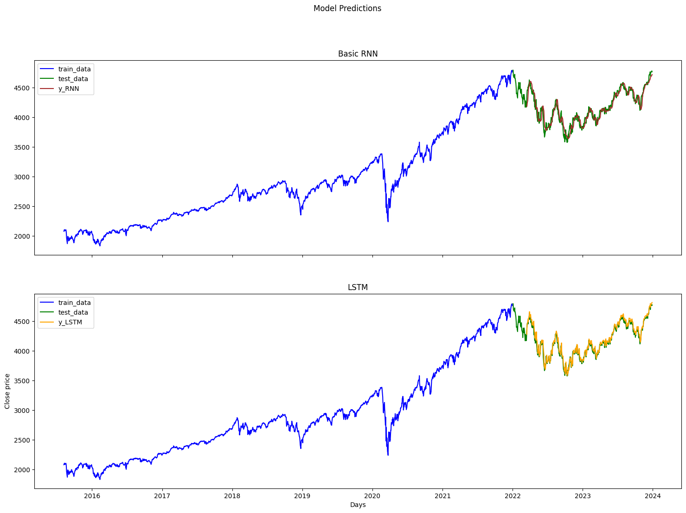

## 1. Introduction

In this project, the objective is to forecast the future prices of the S&P 500 index using a combination of statistical and deep learning models. The S&P 500 is a widely-followed stock market index that measures the performance of 500 of the largest companies listed on stock exchanges in the United States. Accurate forecasting of its prices is crucial for investors, financial analysts, and policymakers.

Three different methodologies will be employed to achieve this goal:

- **ARIMA (AutoRegressive Integrated Moving Average)**: A popular statistical method for time series forecasting that captures the linear dependencies in the data.
- **SARIMA (Seasonal AutoRegressive Integrated Moving Average)**: An extension of ARIMA that handles seasonality in the data, providing a more comprehensive approach for time series with seasonal patterns.
- **LSTM (Long Short-Term Memory)**: A type of recurrent neural network (RNN) that is well-suited for capturing long-term dependencies and non-linear patterns in time series data.

By leveraging these models, the project aims to compare their performance and determine the most effective approach for predicting the S&P 500 index prices. The project will involve several key steps, including data collection, preprocessing, model building, evaluation, and implementation.

### Project Steps

- **Data Collection**: Historical data of the S&P 500 index will be gathered using the Yahoo Finance API.
- **Data Preprocessing**: The data will be cleaned and prepared for modeling. This includes handling missing values, normalizing the data, and creating training and test sets.
- **Model Building**:
   - **ARIMA**: The optimal parameters (p, d, q) will be identified, and the ARIMA model will be fitted.
   - **SARIMA**: The seasonal components will be identified, and the SARIMA model will be fitted.
   - **LSTM**: An LSTM network will be designed and trained to capture the complex patterns in the time series data.
- **Model Evaluation**: The models will be evaluated based on their predictive performance using metrics such as RMSE (Root Mean Squared Error), MAE (Mean Absolute Error), and MAPE (Mean Absolute Percentage Error).
- **Forecasting and Visualization**: The trained models will be used to forecast future prices of the S&P 500, and the results will be visualized to compare their effectiveness.
- **Implementation**: The final models will be deployed in a user-friendly application for real-time forecasting.

By the end of this project, a comprehensive understanding of different time series forecasting techniques and their applicability to financial data is expected. The insights gained from this study will be valuable for making informed investment decisions and improving financial strategies.

## 2. Data Collection

### Import Libraries


```python
import pandas as pd
import numpy as np
import matplotlib.pyplot as plt
import yfinance as yf
```

### Download SP500 data


```python
ticker = '^SPX'

'''
data = yf.download(ticker, start='2015-01-01', end='2023-12-31')
csv_file = 'sp500_data.csv'
data.to_csv(csv_file)
'''

```


    "\ndata = yf.download(ticker, start='2015-01-01', end='2023-12-31')\ncsv_file = 'sp500_data.csv'\ndata.to_csv(csv_file)\n"


```python
#Dataframe
df = pd.read_csv("./sp500_data.csv")
df.head()
```


<div>
<style scoped>
    .dataframe tbody tr th:only-of-type {
        vertical-align: middle;
    }

    .dataframe tbody tr th {
        vertical-align: top;
    }

    .dataframe thead th {
        text-align: right;
    }
</style>
<table border="1" class="dataframe">
  <thead>
    <tr style="text-align: right;">
      <th></th>
      <th>Date</th>
      <th>Open</th>
      <th>High</th>
      <th>Low</th>
      <th>Close</th>
      <th>Adj Close</th>
      <th>Volume</th>
    </tr>
  </thead>
  <tbody>
    <tr>
      <th>0</th>
      <td>2015-01-02</td>
      <td>2058.899902</td>
      <td>2072.360107</td>
      <td>2046.040039</td>
      <td>2058.199951</td>
      <td>2058.199951</td>
      <td>2708700000</td>
    </tr>
    <tr>
      <th>1</th>
      <td>2015-01-05</td>
      <td>2054.439941</td>
      <td>2054.439941</td>
      <td>2017.339966</td>
      <td>2020.579956</td>
      <td>2020.579956</td>
      <td>3799120000</td>
    </tr>
    <tr>
      <th>2</th>
      <td>2015-01-06</td>
      <td>2022.150024</td>
      <td>2030.250000</td>
      <td>1992.439941</td>
      <td>2002.609985</td>
      <td>2002.609985</td>
      <td>4460110000</td>
    </tr>
    <tr>
      <th>3</th>
      <td>2015-01-07</td>
      <td>2005.550049</td>
      <td>2029.609985</td>
      <td>2005.550049</td>
      <td>2025.900024</td>
      <td>2025.900024</td>
      <td>3805480000</td>
    </tr>
    <tr>
      <th>4</th>
      <td>2015-01-08</td>
      <td>2030.609985</td>
      <td>2064.080078</td>
      <td>2030.609985</td>
      <td>2062.139893</td>
      <td>2062.139893</td>
      <td>3934010000</td>
    </tr>
  </tbody>
</table>
</div>


```python
df['Date'] = pd.to_datetime(df['Date'])
df.set_index('Date', inplace=True)
df.head()
```


<div>
<style scoped>
    .dataframe tbody tr th:only-of-type {
        vertical-align: middle;
    }

    .dataframe tbody tr th {
        vertical-align: top;
    }

    .dataframe thead th {
        text-align: right;
    }
</style>
<table border="1" class="dataframe">
  <thead>
    <tr style="text-align: right;">
      <th></th>
      <th>Open</th>
      <th>High</th>
      <th>Low</th>
      <th>Close</th>
      <th>Adj Close</th>
      <th>Volume</th>
    </tr>
    <tr>
      <th>Date</th>
      <th></th>
      <th></th>
      <th></th>
      <th></th>
      <th></th>
      <th></th>
    </tr>
  </thead>
  <tbody>
    <tr>
      <th>2015-01-02</th>
      <td>2058.899902</td>
      <td>2072.360107</td>
      <td>2046.040039</td>
      <td>2058.199951</td>
      <td>2058.199951</td>
      <td>2708700000</td>
    </tr>
    <tr>
      <th>2015-01-05</th>
      <td>2054.439941</td>
      <td>2054.439941</td>
      <td>2017.339966</td>
      <td>2020.579956</td>
      <td>2020.579956</td>
      <td>3799120000</td>
    </tr>
    <tr>
      <th>2015-01-06</th>
      <td>2022.150024</td>
      <td>2030.250000</td>
      <td>1992.439941</td>
      <td>2002.609985</td>
      <td>2002.609985</td>
      <td>4460110000</td>
    </tr>
    <tr>
      <th>2015-01-07</th>
      <td>2005.550049</td>
      <td>2029.609985</td>
      <td>2005.550049</td>
      <td>2025.900024</td>
      <td>2025.900024</td>
      <td>3805480000</td>
    </tr>
    <tr>
      <th>2015-01-08</th>
      <td>2030.609985</td>
      <td>2064.080078</td>
      <td>2030.609985</td>
      <td>2062.139893</td>
      <td>2062.139893</td>
      <td>3934010000</td>
    </tr>
  </tbody>
</table>
</div>


## 3. Data Preprocessing


```python
df.info()
```

    <class 'pandas.core.frame.DataFrame'>
    DatetimeIndex: 2264 entries, 2015-01-02 to 2023-12-29
    Data columns (total 6 columns):
     #   Column     Non-Null Count  Dtype  
    ---  ------     --------------  -----  
     0   Open       2264 non-null   float64
     1   High       2264 non-null   float64
     2   Low        2264 non-null   float64
     3   Close      2264 non-null   float64
     4   Adj Close  2264 non-null   float64
     5   Volume     2264 non-null   int64  
    dtypes: float64(5), int64(1)
    memory usage: 123.8 KB


```python
missing_values = df.isnull().sum()
print(missing_values)
```

    Open         0
    High         0
    Low          0
    Close        0
    Adj Close    0
    Volume       0
    dtype: int64


```python
df.drop_duplicates()
```


<div>
<style scoped>
    .dataframe tbody tr th:only-of-type {
        vertical-align: middle;
    }

    .dataframe tbody tr th {
        vertical-align: top;
    }

    .dataframe thead th {
        text-align: right;
    }
</style>
<table border="1" class="dataframe">
  <thead>
    <tr style="text-align: right;">
      <th></th>
      <th>Open</th>
      <th>High</th>
      <th>Low</th>
      <th>Close</th>
      <th>Adj Close</th>
      <th>Volume</th>
    </tr>
    <tr>
      <th>Date</th>
      <th></th>
      <th></th>
      <th></th>
      <th></th>
      <th></th>
      <th></th>
    </tr>
  </thead>
  <tbody>
    <tr>
      <th>2015-01-02</th>
      <td>2058.899902</td>
      <td>2072.360107</td>
      <td>2046.040039</td>
      <td>2058.199951</td>
      <td>2058.199951</td>
      <td>2708700000</td>
    </tr>
    <tr>
      <th>2015-01-05</th>
      <td>2054.439941</td>
      <td>2054.439941</td>
      <td>2017.339966</td>
      <td>2020.579956</td>
      <td>2020.579956</td>
      <td>3799120000</td>
    </tr>
    <tr>
      <th>2015-01-06</th>
      <td>2022.150024</td>
      <td>2030.250000</td>
      <td>1992.439941</td>
      <td>2002.609985</td>
      <td>2002.609985</td>
      <td>4460110000</td>
    </tr>
    <tr>
      <th>2015-01-07</th>
      <td>2005.550049</td>
      <td>2029.609985</td>
      <td>2005.550049</td>
      <td>2025.900024</td>
      <td>2025.900024</td>
      <td>3805480000</td>
    </tr>
    <tr>
      <th>2015-01-08</th>
      <td>2030.609985</td>
      <td>2064.080078</td>
      <td>2030.609985</td>
      <td>2062.139893</td>
      <td>2062.139893</td>
      <td>3934010000</td>
    </tr>
    <tr>
      <th>...</th>
      <td>...</td>
      <td>...</td>
      <td>...</td>
      <td>...</td>
      <td>...</td>
      <td>...</td>
    </tr>
    <tr>
      <th>2023-12-22</th>
      <td>4753.919922</td>
      <td>4772.939941</td>
      <td>4736.770020</td>
      <td>4754.629883</td>
      <td>4754.629883</td>
      <td>3046770000</td>
    </tr>
    <tr>
      <th>2023-12-26</th>
      <td>4758.859863</td>
      <td>4784.720215</td>
      <td>4758.450195</td>
      <td>4774.750000</td>
      <td>4774.750000</td>
      <td>2513910000</td>
    </tr>
    <tr>
      <th>2023-12-27</th>
      <td>4773.450195</td>
      <td>4785.390137</td>
      <td>4768.899902</td>
      <td>4781.580078</td>
      <td>4781.580078</td>
      <td>2748450000</td>
    </tr>
    <tr>
      <th>2023-12-28</th>
      <td>4786.439941</td>
      <td>4793.299805</td>
      <td>4780.979980</td>
      <td>4783.350098</td>
      <td>4783.350098</td>
      <td>2698860000</td>
    </tr>
    <tr>
      <th>2023-12-29</th>
      <td>4782.879883</td>
      <td>4788.430176</td>
      <td>4751.990234</td>
      <td>4769.830078</td>
      <td>4769.830078</td>
      <td>3126060000</td>
    </tr>
  </tbody>
</table>
<p>2264 rows × 6 columns</p>
</div>


```python
df.describe()
```


<div>
<style scoped>
    .dataframe tbody tr th:only-of-type {
        vertical-align: middle;
    }

    .dataframe tbody tr th {
        vertical-align: top;
    }

    .dataframe thead th {
        text-align: right;
    }
</style>
<table border="1" class="dataframe">
  <thead>
    <tr style="text-align: right;">
      <th></th>
      <th>Open</th>
      <th>High</th>
      <th>Low</th>
      <th>Close</th>
      <th>Adj Close</th>
      <th>Volume</th>
    </tr>
  </thead>
  <tbody>
    <tr>
      <th>count</th>
      <td>2264.000000</td>
      <td>2264.000000</td>
      <td>2264.000000</td>
      <td>2264.000000</td>
      <td>2264.000000</td>
      <td>2.264000e+03</td>
    </tr>
    <tr>
      <th>mean</th>
      <td>3125.004477</td>
      <td>3142.186953</td>
      <td>3106.528294</td>
      <td>3125.483745</td>
      <td>3125.483745</td>
      <td>4.016593e+09</td>
    </tr>
    <tr>
      <th>std</th>
      <td>871.006758</td>
      <td>876.888725</td>
      <td>865.322114</td>
      <td>871.373441</td>
      <td>871.373441</td>
      <td>9.740077e+08</td>
    </tr>
    <tr>
      <th>min</th>
      <td>1833.400024</td>
      <td>1847.000000</td>
      <td>1810.099976</td>
      <td>1829.079956</td>
      <td>1829.079956</td>
      <td>1.296530e+09</td>
    </tr>
    <tr>
      <th>25%</th>
      <td>2365.127502</td>
      <td>2371.260010</td>
      <td>2352.922485</td>
      <td>2363.767517</td>
      <td>2363.767517</td>
      <td>3.413968e+09</td>
    </tr>
    <tr>
      <th>50%</th>
      <td>2891.755005</td>
      <td>2901.049927</td>
      <td>2876.984985</td>
      <td>2888.265015</td>
      <td>2888.265015</td>
      <td>3.817080e+09</td>
    </tr>
    <tr>
      <th>75%</th>
      <td>3973.327515</td>
      <td>4001.487488</td>
      <td>3940.057556</td>
      <td>3971.605042</td>
      <td>3971.605042</td>
      <td>4.375508e+09</td>
    </tr>
    <tr>
      <th>max</th>
      <td>4804.509766</td>
      <td>4818.620117</td>
      <td>4780.979980</td>
      <td>4796.560059</td>
      <td>4796.560059</td>
      <td>9.976520e+09</td>
    </tr>
  </tbody>
</table>
</div>


## 4. Exploratory Data Analysis


```python
# Plot Historial Prices
plt.figure(figsize=(15, 8))
plt.plot(df['Close'])
plt.title('Historical Prices of S&P 500')
plt.xlabel('Date')
plt.ylabel('Closing Price')
plt.show()
```


    

    


## 5. ARIMA


```python
from statsmodels.tsa.stattools import adfuller
from statsmodels.tsa.arima.model import ARIMA
from itertools import product
import warnings
warnings.filterwarnings('ignore')

```


```python
result = adfuller(df['Close'])
print('ADF Statistic: %f' % result[0])
print('p-value: %f' % result[1])
```

    ADF Statistic: -0.418372
    p-value: 0.906986


Hypothesis test results indicate insufficient evidence to reject the null hypothesis at a significance level of 0.05. Additionally, the time series exhibits non-stationarity.


```python
df_diff = df['Close'].diff().dropna()

# Recheck for stationarity
result = adfuller(df_diff)
print('ADF Statistic: %f' % result[0])
print('p-value: %f' % result[1])

# Plot differenced data
plt.figure(figsize=(10, 8))
plt.plot(df_diff)
plt.title('Differenced Closing Prices')
plt.xlabel('Date')
plt.ylabel('')
plt.show()
```

    ADF Statistic: -14.836716
    p-value: 0.000000


    

    


```python
from statsmodels.tsa.seasonal import seasonal_decompose

decomposition = seasonal_decompose(df['Close'], model='additive', period=30)
plt.rcParams["figure.figsize"] = [15, 8]
fig = decomposition.plot()
```


    

    


```python
import pmdarima as pm

# Best ARIMA parameters
auto_arima_model = pm.auto_arima(df.Close,
                              start_p=0, start_q=0,
                              max_p=5, max_q=5,
                              seasonal=True,
                              stepwise=True,
                              suppress_warnings=True,
                              d=0,
                              trace=True)

print(auto_arima_model.summary())

```

    Performing stepwise search to minimize aic
     ARIMA(0,0,0)(0,0,0)[0] intercept   : AIC=37082.833, Time=0.02 sec
     ARIMA(1,0,0)(0,0,0)[0] intercept   : AIC=inf, Time=0.03 sec
     ARIMA(0,0,1)(0,0,0)[0] intercept   : AIC=inf, Time=0.12 sec
     ARIMA(0,0,0)(0,0,0)[0]             : AIC=43034.728, Time=0.01 sec
     ARIMA(1,0,1)(0,0,0)[0] intercept   : AIC=22726.299, Time=0.18 sec
     ARIMA(2,0,1)(0,0,0)[0] intercept   : AIC=22723.076, Time=0.30 sec
     ARIMA(2,0,0)(0,0,0)[0] intercept   : AIC=inf, Time=0.15 sec
     ARIMA(3,0,1)(0,0,0)[0] intercept   : AIC=22723.479, Time=0.42 sec
     ARIMA(2,0,2)(0,0,0)[0] intercept   : AIC=22723.245, Time=0.45 sec
     ARIMA(1,0,2)(0,0,0)[0] intercept   : AIC=22721.751, Time=0.23 sec
     ARIMA(0,0,2)(0,0,0)[0] intercept   : AIC=inf, Time=0.33 sec
     ARIMA(1,0,3)(0,0,0)[0] intercept   : AIC=22722.187, Time=0.36 sec
     ARIMA(0,0,3)(0,0,0)[0] intercept   : AIC=29740.146, Time=1.04 sec
     ARIMA(2,0,3)(0,0,0)[0] intercept   : AIC=22694.713, Time=0.76 sec
     ARIMA(3,0,3)(0,0,0)[0] intercept   : AIC=22648.666, Time=0.93 sec
     ARIMA(3,0,2)(0,0,0)[0] intercept   : AIC=22647.403, Time=0.79 sec
     ARIMA(4,0,2)(0,0,0)[0] intercept   : AIC=22648.763, Time=1.00 sec
     ARIMA(4,0,1)(0,0,0)[0] intercept   : AIC=22724.949, Time=0.51 sec
     ARIMA(4,0,3)(0,0,0)[0] intercept   : AIC=22727.312, Time=1.09 sec
     ARIMA(3,0,2)(0,0,0)[0]             : AIC=22647.682, Time=0.40 sec
    
    Best model:  ARIMA(3,0,2)(0,0,0)[0] intercept
    Total fit time: 9.094 seconds
                                   SARIMAX Results                                
    ==============================================================================
    Dep. Variable:                      y   No. Observations:                 2264
    Model:               SARIMAX(3, 0, 2)   Log Likelihood              -11316.701
    Date:                Thu, 04 Jul 2024   AIC                          22647.403
    Time:                        17:51:53   BIC                          22687.477
    Sample:                             0   HQIC                         22662.025
                                   - 2264                                         
    Covariance Type:                  opg                                         
    ==============================================================================
                     coef    std err          z      P>|z|      [0.025      0.975]
    ------------------------------------------------------------------------------
    intercept      2.7191     12.353      0.220      0.826     -21.493      26.931
    ar.L1         -0.7662      0.018    -42.238      0.000      -0.802      -0.731
    ar.L2          0.8757      0.006    145.910      0.000       0.864       0.887
    ar.L3          0.8897      0.017     52.432      0.000       0.856       0.923
    ma.L1          1.6959      0.023     73.710      0.000       1.651       1.741
    ma.L2          0.7993      0.022     36.582      0.000       0.756       0.842
    sigma2      1285.1447     20.735     61.981      0.000    1244.506    1325.784
    ===================================================================================
    Ljung-Box (L1) (Q):                   0.29   Jarque-Bera (JB):              3745.11
    Prob(Q):                              0.59   Prob(JB):                         0.00
    Heteroskedasticity (H):               7.95   Skew:                            -0.68
    Prob(H) (two-sided):                  0.00   Kurtosis:                         9.15
    ===================================================================================
    
    Warnings:
    [1] Covariance matrix calculated using the outer product of gradients (complex-step).


```python
auto_arima_model.summary()
```


<table class="simpletable">
<caption>SARIMAX Results</caption>
<tr>
  <th>Dep. Variable:</th>           <td>y</td>        <th>  No. Observations:  </th>    <td>2264</td>   
</tr>
<tr>
  <th>Model:</th>           <td>SARIMAX(3, 0, 2)</td> <th>  Log Likelihood     </th> <td>-11316.701</td>
</tr>
<tr>
  <th>Date:</th>            <td>Thu, 04 Jul 2024</td> <th>  AIC                </th>  <td>22647.403</td>
</tr>
<tr>
  <th>Time:</th>                <td>17:51:53</td>     <th>  BIC                </th>  <td>22687.477</td>
</tr>
<tr>
  <th>Sample:</th>                  <td>0</td>        <th>  HQIC               </th>  <td>22662.025</td>
</tr>
<tr>
  <th></th>                      <td> - 2264</td>     <th>                     </th>      <td> </td>    
</tr>
<tr>
  <th>Covariance Type:</th>        <td>opg</td>       <th>                     </th>      <td> </td>    
</tr>
</table>
<table class="simpletable">
<tr>
      <td></td>         <th>coef</th>     <th>std err</th>      <th>z</th>      <th>P>|z|</th>  <th>[0.025</th>    <th>0.975]</th>  
</tr>
<tr>
  <th>intercept</th> <td>    2.7191</td> <td>   12.353</td> <td>    0.220</td> <td> 0.826</td> <td>  -21.493</td> <td>   26.931</td>
</tr>
<tr>
  <th>ar.L1</th>     <td>   -0.7662</td> <td>    0.018</td> <td>  -42.238</td> <td> 0.000</td> <td>   -0.802</td> <td>   -0.731</td>
</tr>
<tr>
  <th>ar.L2</th>     <td>    0.8757</td> <td>    0.006</td> <td>  145.910</td> <td> 0.000</td> <td>    0.864</td> <td>    0.887</td>
</tr>
<tr>
  <th>ar.L3</th>     <td>    0.8897</td> <td>    0.017</td> <td>   52.432</td> <td> 0.000</td> <td>    0.856</td> <td>    0.923</td>
</tr>
<tr>
  <th>ma.L1</th>     <td>    1.6959</td> <td>    0.023</td> <td>   73.710</td> <td> 0.000</td> <td>    1.651</td> <td>    1.741</td>
</tr>
<tr>
  <th>ma.L2</th>     <td>    0.7993</td> <td>    0.022</td> <td>   36.582</td> <td> 0.000</td> <td>    0.756</td> <td>    0.842</td>
</tr>
<tr>
  <th>sigma2</th>    <td> 1285.1447</td> <td>   20.735</td> <td>   61.981</td> <td> 0.000</td> <td> 1244.506</td> <td> 1325.784</td>
</tr>
</table>
<table class="simpletable">
<tr>
  <th>Ljung-Box (L1) (Q):</th>     <td>0.29</td> <th>  Jarque-Bera (JB):  </th> <td>3745.11</td>
</tr>
<tr>
  <th>Prob(Q):</th>                <td>0.59</td> <th>  Prob(JB):          </th>  <td>0.00</td>  
</tr>
<tr>
  <th>Heteroskedasticity (H):</th> <td>7.95</td> <th>  Skew:              </th>  <td>-0.68</td> 
</tr>
<tr>
  <th>Prob(H) (two-sided):</th>    <td>0.00</td> <th>  Kurtosis:          </th>  <td>9.15</td>  
</tr>
</table><br/><br/>Warnings:<br/>[1] Covariance matrix calculated using the outer product of gradients (complex-step).


```python
Train_end = 1763 #Index
# Create Training and Test
train = df.Close[:Train_end]
test = df.Close[Train_end:]
```


```python
test
```


    Date
    2022-01-03    4796.560059
    2022-01-04    4793.540039
    2022-01-05    4700.580078
    2022-01-06    4696.049805
    2022-01-07    4677.029785
                     ...     
    2023-12-22    4754.629883
    2023-12-26    4774.750000
    2023-12-27    4781.580078
    2023-12-28    4783.350098
    2023-12-29    4769.830078
    Name: Close, Length: 501, dtype: float64


```python
from statsmodels.tsa.statespace.sarimax import SARIMAX 
```


```python
# ARIMA model
best_p, best_d, best_q = auto_arima_model.order
arima_model = ARIMA(train, order=(best_p, best_d, best_q))
arima_model_fit = arima_model.fit()

```


```python
# Forecast
fc_arima = arima_model_fit.forecast(501, alpha=0.05)  # 95% conf
fc_arima.index = test.index
```


```python
# Crear una figura y ejes
plt.figure(figsize=(10, 6))

# Graficar las predicciones y los valores reales en una sola gráfica
plt.plot(fc_arima, label='Predictions')
plt.plot(test, label='Actual Values')

# Añadir etiquetas, título y leyenda
plt.xlabel('Date')
plt.ylabel('Value')
plt.title('ARIMA Predictions vs Actual Values')
plt.legend()

# Mostrar la gráfica
plt.show()
```


    

    


## LSTM


```python
train_end = 1763 #Index
# Create Training and Test
train_data = df['Close'][:train_end]
test_data = df['Close'][train_end:]
```


```python
test_data
```


    Date
    2022-01-03    4796.560059
    2022-01-04    4793.540039
    2022-01-05    4700.580078
    2022-01-06    4696.049805
    2022-01-07    4677.029785
                     ...     
    2023-12-22    4754.629883
    2023-12-26    4774.750000
    2023-12-27    4781.580078
    2023-12-28    4783.350098
    2023-12-29    4769.830078
    Name: Close, Length: 501, dtype: float64


```python
# Selecting Price values
dataset_train = train_data.values

# Reshaping 1D to 2D array
dataset_train = np.reshape(dataset_train, (-1,1))
dataset_train.shape

```


    (1763, 1)


```python
# Selecting Price values
dataset_test = test_data.values

# Reshaping 1D to 2D array
dataset_test = np.reshape(dataset_test, (-1,1))
dataset_test.shape

```


    (501, 1)


```python
from sklearn.preprocessing import MinMaxScaler
scaler = MinMaxScaler(feature_range=(0,1))

# scaling dataset
scaled_train = scaler.fit_transform(dataset_train)
scaled_test = scaler.fit_transform(dataset_test)


```


```python
X_train = []
y_train = []
for i in range(50, len(scaled_train)):
	X_train.append(scaled_train[i-50:i, 0])
	y_train.append(scaled_train[i, 0])
	if i <= 51:
		print(X_train)
		print(y_train)
		print()

```

    [array([0.07730146, 0.06460907, 0.05854629, 0.06640398, 0.07863074,
           0.07278392, 0.0672002 , 0.06543569, 0.06146805, 0.05519271,
           0.06421773, 0.06527375, 0.0685025 , 0.0789715 , 0.07514899,
           0.07692701, 0.06763544, 0.05839448, 0.06483513, 0.05597542,
           0.06470017, 0.07454506, 0.07167054, 0.07875898, 0.07638041,
           0.07343505, 0.08080693, 0.08078667, 0.08751746, 0.09038861,
           0.09151888, 0.09129615, 0.09054379, 0.09487921, 0.09466324,
           0.09662684, 0.09608032, 0.09502764, 0.09292237, 0.09727121,
           0.094029  , 0.09090819, 0.09175503, 0.08170772, 0.08446412,
           0.07256462, 0.07124206, 0.07991619, 0.075682  , 0.08505792])]
    [0.08272662594196878]
    
    [array([0.07730146, 0.06460907, 0.05854629, 0.06640398, 0.07863074,
           0.07278392, 0.0672002 , 0.06543569, 0.06146805, 0.05519271,
           0.06421773, 0.06527375, 0.0685025 , 0.0789715 , 0.07514899,
           0.07692701, 0.06763544, 0.05839448, 0.06483513, 0.05597542,
           0.06470017, 0.07454506, 0.07167054, 0.07875898, 0.07638041,
           0.07343505, 0.08080693, 0.08078667, 0.08751746, 0.09038861,
           0.09151888, 0.09129615, 0.09054379, 0.09487921, 0.09466324,
           0.09662684, 0.09608032, 0.09502764, 0.09292237, 0.09727121,
           0.094029  , 0.09090819, 0.09175503, 0.08170772, 0.08446412,
           0.07256462, 0.07124206, 0.07991619, 0.075682  , 0.08505792]), array([0.06460907, 0.05854629, 0.06640398, 0.07863074, 0.07278392,
           0.0672002 , 0.06543569, 0.06146805, 0.05519271, 0.06421773,
           0.06527375, 0.0685025 , 0.0789715 , 0.07514899, 0.07692701,
           0.06763544, 0.05839448, 0.06483513, 0.05597542, 0.06470017,
           0.07454506, 0.07167054, 0.07875898, 0.07638041, 0.07343505,
           0.08080693, 0.08078667, 0.08751746, 0.09038861, 0.09151888,
           0.09129615, 0.09054379, 0.09487921, 0.09466324, 0.09662684,
           0.09608032, 0.09502764, 0.09292237, 0.09727121, 0.094029  ,
           0.09090819, 0.09175503, 0.08170772, 0.08446412, 0.07256462,
           0.07124206, 0.07991619, 0.075682  , 0.08505792, 0.08272663])]
    [0.08272662594196878, 0.09123544510763082]
    


```python
X_test = []
y_test = []
for i in range(50, len(scaled_test)):
	X_test.append(scaled_test[i-50:i, 0])
	y_test.append(scaled_test[i, 0])

```


```python
# The data is converted to Numpy array
X_train, y_train = np.array(X_train), np.array(y_train)

#Reshaping
X_train = np.reshape(X_train, (X_train.shape[0], X_train.shape[1],1))
y_train = np.reshape(y_train, (y_train.shape[0],1))
print("X_train :",X_train.shape,"y_train :",y_train.shape)

```

    X_train : (1713, 50, 1) y_train : (1713, 1)


```python
# The data is converted to numpy array
X_test, y_test = np.array(X_test), np.array(y_test)

#Reshaping
X_test = np.reshape(X_test, (X_test.shape[0], X_test.shape[1],1))
y_test = np.reshape(y_test, (y_test.shape[0],1))
print("X_test :",X_test.shape,"y_test :",y_test.shape)

```

    X_test : (451, 50, 1) y_test : (451, 1)


```python
# importing libraries
from keras.models import Sequential
from keras.layers import LSTM
from keras.layers import Dense
from keras.layers import SimpleRNN
from keras.layers import Dropout
from keras.layers import GRU, Bidirectional
from keras.optimizers import SGD
from sklearn import metrics
from sklearn.metrics import mean_squared_error

```

    2024-07-04 17:51:54.427101: I tensorflow/core/util/port.cc:113] oneDNN custom operations are on. You may see slightly different numerical results due to floating-point round-off errors from different computation orders. To turn them off, set the environment variable `TF_ENABLE_ONEDNN_OPTS=0`.
    2024-07-04 17:51:54.433734: E external/local_xla/xla/stream_executor/cuda/cuda_fft.cc:479] Unable to register cuFFT factory: Attempting to register factory for plugin cuFFT when one has already been registered
    2024-07-04 17:51:54.442218: E external/local_xla/xla/stream_executor/cuda/cuda_dnn.cc:10575] Unable to register cuDNN factory: Attempting to register factory for plugin cuDNN when one has already been registered
    2024-07-04 17:51:54.442237: E external/local_xla/xla/stream_executor/cuda/cuda_blas.cc:1442] Unable to register cuBLAS factory: Attempting to register factory for plugin cuBLAS when one has already been registered
    2024-07-04 17:51:54.448509: I tensorflow/core/platform/cpu_feature_guard.cc:210] This TensorFlow binary is optimized to use available CPU instructions in performance-critical operations.
    To enable the following instructions: AVX2 AVX_VNNI FMA, in other operations, rebuild TensorFlow with the appropriate compiler flags.
    2024-07-04 17:51:54.888943: W tensorflow/compiler/tf2tensorrt/utils/py_utils.cc:38] TF-TRT Warning: Could not find TensorRT


```python
# initializing the RNN
regressor = Sequential()

# adding RNN layers and dropout regularization
regressor.add(SimpleRNN(units = 50, 
						activation = "tanh",
						return_sequences = True,
						input_shape = (X_train.shape[1],1)))
regressor.add(Dropout(0.2))

regressor.add(SimpleRNN(units = 50, 
						activation = "tanh",
						return_sequences = True))

regressor.add(SimpleRNN(units = 50,
						activation = "tanh",
						return_sequences = True))

regressor.add( SimpleRNN(units = 50))

# adding the output layer
regressor.add(Dense(units = 1,activation='sigmoid'))

# compiling RNN
regressor.compile(optimizer = SGD(learning_rate=0.01,
								decay=1e-6, 
								momentum=0.9, 
								nesterov=True), 
				loss = "mean_squared_error")

# fitting the model
regressor.fit(X_train, y_train, epochs = 20, batch_size = 2)
regressor.summary()

```

    Epoch 1/20


    2024-07-04 17:51:55.674263: I external/local_xla/xla/stream_executor/cuda/cuda_executor.cc:984] could not open file to read NUMA node: /sys/bus/pci/devices/0000:01:00.0/numa_node
    Your kernel may have been built without NUMA support.
    2024-07-04 17:51:55.769910: W tensorflow/core/common_runtime/gpu/gpu_device.cc:2251] Cannot dlopen some GPU libraries. Please make sure the missing libraries mentioned above are installed properly if you would like to use GPU. Follow the guide at https://www.tensorflow.org/install/gpu for how to download and setup the required libraries for your platform.
    Skipping registering GPU devices...


    857/857 ━━━━━━━━━━━━━━━━━━━━ 12s 13ms/step - loss: 0.0136
    Epoch 2/20
    857/857 ━━━━━━━━━━━━━━━━━━━━ 20s 13ms/step - loss: 0.0016
    Epoch 3/20
    857/857 ━━━━━━━━━━━━━━━━━━━━ 11s 13ms/step - loss: 9.8297e-04
    Epoch 4/20
    857/857 ━━━━━━━━━━━━━━━━━━━━ 11s 13ms/step - loss: 9.4045e-04
    Epoch 5/20
    857/857 ━━━━━━━━━━━━━━━━━━━━ 11s 13ms/step - loss: 8.2393e-04
    Epoch 6/20
    857/857 ━━━━━━━━━━━━━━━━━━━━ 11s 13ms/step - loss: 6.9941e-04
    Epoch 7/20
    857/857 ━━━━━━━━━━━━━━━━━━━━ 11s 13ms/step - loss: 6.9829e-04
    Epoch 8/20
    857/857 ━━━━━━━━━━━━━━━━━━━━ 11s 13ms/step - loss: 8.1549e-04
    Epoch 9/20
    857/857 ━━━━━━━━━━━━━━━━━━━━ 11s 13ms/step - loss: 6.4103e-04
    Epoch 10/20
    857/857 ━━━━━━━━━━━━━━━━━━━━ 11s 13ms/step - loss: 6.1222e-04
    Epoch 11/20
    857/857 ━━━━━━━━━━━━━━━━━━━━ 11s 12ms/step - loss: 5.8561e-04
    Epoch 12/20
    857/857 ━━━━━━━━━━━━━━━━━━━━ 11s 13ms/step - loss: 5.8497e-04
    Epoch 13/20
    857/857 ━━━━━━━━━━━━━━━━━━━━ 11s 13ms/step - loss: 5.7350e-04
    Epoch 14/20
    857/857 ━━━━━━━━━━━━━━━━━━━━ 11s 13ms/step - loss: 5.5336e-04
    Epoch 15/20
    857/857 ━━━━━━━━━━━━━━━━━━━━ 11s 13ms/step - loss: 5.4327e-04
    Epoch 16/20
    857/857 ━━━━━━━━━━━━━━━━━━━━ 11s 13ms/step - loss: 5.2505e-04
    Epoch 17/20
    857/857 ━━━━━━━━━━━━━━━━━━━━ 11s 13ms/step - loss: 5.0126e-04
    Epoch 18/20
    857/857 ━━━━━━━━━━━━━━━━━━━━ 11s 13ms/step - loss: 5.1273e-04
    Epoch 19/20
    857/857 ━━━━━━━━━━━━━━━━━━━━ 11s 13ms/step - loss: 5.1467e-04
    Epoch 20/20
    857/857 ━━━━━━━━━━━━━━━━━━━━ 11s 13ms/step - loss: 5.3530e-04


<pre style="white-space:pre;overflow-x:auto;line-height:normal;font-family:Menlo,'DejaVu Sans Mono',consolas,'Courier New',monospace"><span style="font-weight: bold">Model: "sequential"</span>
</pre>


<pre style="white-space:pre;overflow-x:auto;line-height:normal;font-family:Menlo,'DejaVu Sans Mono',consolas,'Courier New',monospace">┏━━━━━━━━━━━━━━━━━━━━━━━━━━━━━━━━━┳━━━━━━━━━━━━━━━━━━━━━━━━┳━━━━━━━━━━━━━━━┓
┃<span style="font-weight: bold"> Layer (type)                    </span>┃<span style="font-weight: bold"> Output Shape           </span>┃<span style="font-weight: bold">       Param # </span>┃
┡━━━━━━━━━━━━━━━━━━━━━━━━━━━━━━━━━╇━━━━━━━━━━━━━━━━━━━━━━━━╇━━━━━━━━━━━━━━━┩
│ simple_rnn (<span style="color: #0087ff; text-decoration-color: #0087ff">SimpleRNN</span>)          │ (<span style="color: #00d7ff; text-decoration-color: #00d7ff">None</span>, <span style="color: #00af00; text-decoration-color: #00af00">50</span>, <span style="color: #00af00; text-decoration-color: #00af00">50</span>)         │         <span style="color: #00af00; text-decoration-color: #00af00">2,600</span> │
├─────────────────────────────────┼────────────────────────┼───────────────┤
│ dropout (<span style="color: #0087ff; text-decoration-color: #0087ff">Dropout</span>)               │ (<span style="color: #00d7ff; text-decoration-color: #00d7ff">None</span>, <span style="color: #00af00; text-decoration-color: #00af00">50</span>, <span style="color: #00af00; text-decoration-color: #00af00">50</span>)         │             <span style="color: #00af00; text-decoration-color: #00af00">0</span> │
├─────────────────────────────────┼────────────────────────┼───────────────┤
│ simple_rnn_1 (<span style="color: #0087ff; text-decoration-color: #0087ff">SimpleRNN</span>)        │ (<span style="color: #00d7ff; text-decoration-color: #00d7ff">None</span>, <span style="color: #00af00; text-decoration-color: #00af00">50</span>, <span style="color: #00af00; text-decoration-color: #00af00">50</span>)         │         <span style="color: #00af00; text-decoration-color: #00af00">5,050</span> │
├─────────────────────────────────┼────────────────────────┼───────────────┤
│ simple_rnn_2 (<span style="color: #0087ff; text-decoration-color: #0087ff">SimpleRNN</span>)        │ (<span style="color: #00d7ff; text-decoration-color: #00d7ff">None</span>, <span style="color: #00af00; text-decoration-color: #00af00">50</span>, <span style="color: #00af00; text-decoration-color: #00af00">50</span>)         │         <span style="color: #00af00; text-decoration-color: #00af00">5,050</span> │
├─────────────────────────────────┼────────────────────────┼───────────────┤
│ simple_rnn_3 (<span style="color: #0087ff; text-decoration-color: #0087ff">SimpleRNN</span>)        │ (<span style="color: #00d7ff; text-decoration-color: #00d7ff">None</span>, <span style="color: #00af00; text-decoration-color: #00af00">50</span>)             │         <span style="color: #00af00; text-decoration-color: #00af00">5,050</span> │
├─────────────────────────────────┼────────────────────────┼───────────────┤
│ dense (<span style="color: #0087ff; text-decoration-color: #0087ff">Dense</span>)                   │ (<span style="color: #00d7ff; text-decoration-color: #00d7ff">None</span>, <span style="color: #00af00; text-decoration-color: #00af00">1</span>)              │            <span style="color: #00af00; text-decoration-color: #00af00">51</span> │
└─────────────────────────────────┴────────────────────────┴───────────────┘
</pre>


<pre style="white-space:pre;overflow-x:auto;line-height:normal;font-family:Menlo,'DejaVu Sans Mono',consolas,'Courier New',monospace"><span style="font-weight: bold"> Total params: </span><span style="color: #00af00; text-decoration-color: #00af00">35,604</span> (139.08 KB)
</pre>


<pre style="white-space:pre;overflow-x:auto;line-height:normal;font-family:Menlo,'DejaVu Sans Mono',consolas,'Courier New',monospace"><span style="font-weight: bold"> Trainable params: </span><span style="color: #00af00; text-decoration-color: #00af00">17,801</span> (69.54 KB)
</pre>


<pre style="white-space:pre;overflow-x:auto;line-height:normal;font-family:Menlo,'DejaVu Sans Mono',consolas,'Courier New',monospace"><span style="font-weight: bold"> Non-trainable params: </span><span style="color: #00af00; text-decoration-color: #00af00">0</span> (0.00 B)
</pre>


<pre style="white-space:pre;overflow-x:auto;line-height:normal;font-family:Menlo,'DejaVu Sans Mono',consolas,'Courier New',monospace"><span style="font-weight: bold"> Optimizer params: </span><span style="color: #00af00; text-decoration-color: #00af00">17,803</span> (69.55 KB)
</pre>


```python
#Initialising the model
regressorLSTM = Sequential()

#Adding LSTM layers
regressorLSTM.add(LSTM(50, 
					return_sequences = True, 
					input_shape = (X_train.shape[1],1)))
regressorLSTM.add(LSTM(50, 
					return_sequences = False))
regressorLSTM.add(Dense(25))

#Adding the output layer
regressorLSTM.add(Dense(1))

#Compiling the model
regressorLSTM.compile(optimizer = 'adam',
					loss = 'mean_squared_error',
					metrics = ["accuracy"])

#Fitting the model
regressorLSTM.fit(X_train, 
				y_train, 
				batch_size = 1, 
				epochs = 12)
regressorLSTM.summary()

```

    Epoch 1/12
    1713/1713 ━━━━━━━━━━━━━━━━━━━━ 11s 6ms/step - accuracy: 0.0012 - loss: 0.0084
    Epoch 2/12
    1713/1713 ━━━━━━━━━━━━━━━━━━━━ 10s 6ms/step - accuracy: 6.4761e-04 - loss: 7.2294e-04
    Epoch 3/12
    1713/1713 ━━━━━━━━━━━━━━━━━━━━ 10s 6ms/step - accuracy: 8.8511e-04 - loss: 5.3997e-04
    Epoch 4/12
    1713/1713 ━━━━━━━━━━━━━━━━━━━━ 10s 6ms/step - accuracy: 3.5425e-04 - loss: 5.1842e-04
    Epoch 5/12
    1713/1713 ━━━━━━━━━━━━━━━━━━━━ 10s 6ms/step - accuracy: 0.0017 - loss: 4.5730e-04
    Epoch 6/12
    1713/1713 ━━━━━━━━━━━━━━━━━━━━ 10s 6ms/step - accuracy: 8.1241e-04 - loss: 3.5432e-04
    Epoch 7/12
    1713/1713 ━━━━━━━━━━━━━━━━━━━━ 10s 6ms/step - accuracy: 0.0015 - loss: 3.5856e-04
    Epoch 8/12
    1713/1713 ━━━━━━━━━━━━━━━━━━━━ 10s 6ms/step - accuracy: 0.0012 - loss: 2.5012e-04
    Epoch 9/12
    1713/1713 ━━━━━━━━━━━━━━━━━━━━ 10s 6ms/step - accuracy: 7.2090e-05 - loss: 3.3976e-04
    Epoch 10/12
    1713/1713 ━━━━━━━━━━━━━━━━━━━━ 10s 6ms/step - accuracy: 8.2796e-04 - loss: 3.2131e-04
    Epoch 11/12
    1713/1713 ━━━━━━━━━━━━━━━━━━━━ 10s 6ms/step - accuracy: 5.5578e-04 - loss: 2.9899e-04
    Epoch 12/12
    1713/1713 ━━━━━━━━━━━━━━━━━━━━ 10s 6ms/step - accuracy: 0.0018 - loss: 2.7035e-04


<pre style="white-space:pre;overflow-x:auto;line-height:normal;font-family:Menlo,'DejaVu Sans Mono',consolas,'Courier New',monospace"><span style="font-weight: bold">Model: "sequential_1"</span>
</pre>


<pre style="white-space:pre;overflow-x:auto;line-height:normal;font-family:Menlo,'DejaVu Sans Mono',consolas,'Courier New',monospace">┏━━━━━━━━━━━━━━━━━━━━━━━━━━━━━━━━━┳━━━━━━━━━━━━━━━━━━━━━━━━┳━━━━━━━━━━━━━━━┓
┃<span style="font-weight: bold"> Layer (type)                    </span>┃<span style="font-weight: bold"> Output Shape           </span>┃<span style="font-weight: bold">       Param # </span>┃
┡━━━━━━━━━━━━━━━━━━━━━━━━━━━━━━━━━╇━━━━━━━━━━━━━━━━━━━━━━━━╇━━━━━━━━━━━━━━━┩
│ lstm (<span style="color: #0087ff; text-decoration-color: #0087ff">LSTM</span>)                     │ (<span style="color: #00d7ff; text-decoration-color: #00d7ff">None</span>, <span style="color: #00af00; text-decoration-color: #00af00">50</span>, <span style="color: #00af00; text-decoration-color: #00af00">50</span>)         │        <span style="color: #00af00; text-decoration-color: #00af00">10,400</span> │
├─────────────────────────────────┼────────────────────────┼───────────────┤
│ lstm_1 (<span style="color: #0087ff; text-decoration-color: #0087ff">LSTM</span>)                   │ (<span style="color: #00d7ff; text-decoration-color: #00d7ff">None</span>, <span style="color: #00af00; text-decoration-color: #00af00">50</span>)             │        <span style="color: #00af00; text-decoration-color: #00af00">20,200</span> │
├─────────────────────────────────┼────────────────────────┼───────────────┤
│ dense_1 (<span style="color: #0087ff; text-decoration-color: #0087ff">Dense</span>)                 │ (<span style="color: #00d7ff; text-decoration-color: #00d7ff">None</span>, <span style="color: #00af00; text-decoration-color: #00af00">25</span>)             │         <span style="color: #00af00; text-decoration-color: #00af00">1,275</span> │
├─────────────────────────────────┼────────────────────────┼───────────────┤
│ dense_2 (<span style="color: #0087ff; text-decoration-color: #0087ff">Dense</span>)                 │ (<span style="color: #00d7ff; text-decoration-color: #00d7ff">None</span>, <span style="color: #00af00; text-decoration-color: #00af00">1</span>)              │            <span style="color: #00af00; text-decoration-color: #00af00">26</span> │
└─────────────────────────────────┴────────────────────────┴───────────────┘
</pre>


<pre style="white-space:pre;overflow-x:auto;line-height:normal;font-family:Menlo,'DejaVu Sans Mono',consolas,'Courier New',monospace"><span style="font-weight: bold"> Total params: </span><span style="color: #00af00; text-decoration-color: #00af00">95,705</span> (373.85 KB)
</pre>


<pre style="white-space:pre;overflow-x:auto;line-height:normal;font-family:Menlo,'DejaVu Sans Mono',consolas,'Courier New',monospace"><span style="font-weight: bold"> Trainable params: </span><span style="color: #00af00; text-decoration-color: #00af00">31,901</span> (124.61 KB)
</pre>


<pre style="white-space:pre;overflow-x:auto;line-height:normal;font-family:Menlo,'DejaVu Sans Mono',consolas,'Courier New',monospace"><span style="font-weight: bold"> Non-trainable params: </span><span style="color: #00af00; text-decoration-color: #00af00">0</span> (0.00 B)
</pre>


<pre style="white-space:pre;overflow-x:auto;line-height:normal;font-family:Menlo,'DejaVu Sans Mono',consolas,'Courier New',monospace"><span style="font-weight: bold"> Optimizer params: </span><span style="color: #00af00; text-decoration-color: #00af00">63,804</span> (249.24 KB)
</pre>


```python
# predictions with X_test data
y_RNN = regressor.predict(X_test)
y_LSTM = regressorLSTM.predict(X_test)

```

    15/15 ━━━━━━━━━━━━━━━━━━━━ 1s 25ms/step
    15/15 ━━━━━━━━━━━━━━━━━━━━ 0s 13ms/step


```python
# scaling back from 0-1 to original
y_RNN_O = scaler.inverse_transform(y_RNN) 
y_LSTM_O = scaler.inverse_transform(y_LSTM) 

```


```python
fig, axs = plt.subplots(2,figsize =(18,12),sharex=True, sharey=True)
fig.suptitle('Model Predictions')

#Plot for RNN predictions
axs[0].plot(train_data.index[150:], train_data[150:], label = "train_data", color = "b")
axs[0].plot(test_data.index, test_data, label = "test_data", color = "g")
axs[0].plot(test_data.index[50:], y_RNN_O, label = "y_RNN", color = "brown")
axs[0].legend()
axs[0].title.set_text("Basic RNN")

#Plot for LSTM predictions
axs[1].plot(train_data.index[150:], train_data[150:], label = "train_data", color = "b")
axs[1].plot(test_data.index, test_data, label = "test_data", color = "g")
axs[1].plot(test_data.index[50:], y_LSTM_O, label = "y_LSTM", color = "orange")
axs[1].legend()
axs[1].title.set_text("LSTM")

plt.xlabel("Days")
plt.ylabel("Close price")

plt.show()

```


    

    


```python
fig, axs = plt.subplots(2,figsize =(18,12),sharex=True, sharey=True)
fig.suptitle('Model Predictions')

#Plot for RNN predictions
axs[0].plot(test_data.index, test_data, label = "test_data", color = "g")
axs[0].plot(test_data.index[50:], y_RNN_O, label = "y_RNN", color = "r")
axs[0].legend()
axs[0].title.set_text("Basic RNN")

#Plot for LSTM predictions
axs[1].plot(test_data.index, test_data, label = "test_data", color = "g")
axs[1].plot(test_data.index[50:], y_LSTM_O, label = "y_LSTM", color = "r")
axs[1].legend()
axs[1].title.set_text("LSTM")

plt.xlabel("Days")
plt.ylabel("Close price")

plt.show()

```


    

    

